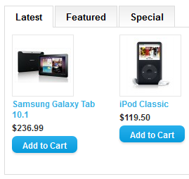

# All in one tab [latest, bestseller, special, featured] for Open Cart 2.0.x
This is a free extension was developed by [amdev](http://www.opencart.com/index.php?route=extension/extension&filter_username=amdev).
I found it on the [link](http://www.opencart.com/index.php?route=extension/extension/info&extension_id=7036). 
The extension works for Open Cart 1.5.x versions. I needed it, so I decided to adapt it for the last version of Open Cart.

## Usage
  > Easy installation no files overwritten.
    
  > 1.Upload 2 folders "admin" and "catalog" to your OC install path.

  > 2.Goto "Admin>Extension>Module>Product Tab"

  > 3.Done!!!

-- amdev

## Languages
* Russian
* English
